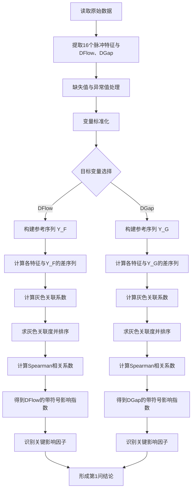

下面给出针对**第1小问**的**灰色关联分析（GRA）建模完整方案**。这份内容按照竞赛论文可直接写入正文的标准组织，重点解决题目要求的两件事：
一是分析 16 个脉冲特征参数与两个关键控制变量 **DFlow、DGap** 的**量化关系**；
二是评估各脉冲特征参数对两个控制变量的**影响大小**。题目明确指出，研究对象为 16 个脉冲特征参数及两个关键控制变量 DFlow、DGap。 

需要先说明一点：**灰色关联分析本身更擅长刻画“关联强弱”而非严格的函数映射方向**。因此，若要完整回答“量化关系”，最稳妥的做法是：
**以 GRA 为主模型识别影响强弱，以相关系数符号作为方向辅助。**
这样既保留了 GRA 对小样本、弱分布假设的优势，又能补足“正向/负向关系”的解释层。

---

# 一、问题重述与模型定位

第1问要求：依据样本数据，分析 16 个脉冲特征参数与 DFlow、DGap 之间的关系，并评估影响大小。就建模性质而言，这不是决策优化题，而是一个典型的**关联识别—影响排序—解释分析**问题。

题目给出的 16 个特征参数包括 A、B、C、I 四类脉冲在“均值时间、标准差时间、均值负载时间、标准差负载时间”四个层面的特征；输出对象为 **DFlow（工作液流量控制变量）** 与 **DGap（放电间隙控制变量）**。

因此，第1问可以构建两套平行的灰色关联模型：

* **模型 A：16 个脉冲特征 → DFlow**
* **模型 B：16 个脉冲特征 → DGap**

二者的比较结果共同构成第1问的最终结论。

---

# 二、模型准备

## 2.1 建模目标

设共有 (n) 组样本，每组样本记录了 16 个脉冲特征及对应的 DFlow、DGap 值。我们的目标是：

1. 分别计算每个脉冲特征与 DFlow 的灰色关联度；
2. 分别计算每个脉冲特征与 DGap 的灰色关联度；
3. 对关联度进行排序，识别关键影响因子；
4. 结合相关系数符号，补充说明其作用方向。

---

## 2.2 为什么选灰色关联分析

灰色关联分析适用于以下场景：

* 样本量不一定很大；
* 变量之间关系可能复杂、非线性、非正态；
* 需要从多个候选指标中快速识别“谁更重要”。

本题恰好属于典型的工业过程数据分析：输入变量较多，控制变量较少，目标是比较各特征与控制变量的关联强弱，而非直接做高精度预测。因此，用 GRA 作为第1问主模型是合理的。

---

# 三、变量定义

第1问本质上是分析评价问题，**没有显式“决策变量”**；但为了满足规范化建模表达，仍按“输入变量—中间变量—目标变量”的结构给出符号系统。

## 3.1 原始变量定义表

| 类别   | 符号           | 含义                                       | 类型 | 单位      | 约束范围    |
| ---- | ------------ | ---------------------------------------- | -- | ------- | ------- |
| 输入变量 | (X_i(k))     | 第 (k) 个样本在第 (i) 个脉冲特征上的取值，(i=1,\dots,16) | 连续 | 依字段原始单位 | 由样本数据给定 |
| 目标变量 | (Y^{(F)}(k)) | 第 (k) 个样本对应的 DFlow 值                     | 连续 | 题目未显式给出 | 由样本数据给定 |
| 目标变量 | (Y^{(G)}(k)) | 第 (k) 个样本对应的 DGap 值                      | 连续 | 题目未显式给出 | 由样本数据给定 |

其中，16 个输入变量对应字段如下。

| (i) | 字段名         | 含义             |
| --- | ----------- | -------------- |
| 1   | ASM_A_MeanT | A类脉冲的均值时间特征    |
| 2   | ASD_A_SDevT | A类脉冲的标准差时间特征   |
| 3   | BSM_B_MeanT | B类脉冲的均值时间特征    |
| 4   | BSD_B_SDevT | B类脉冲的标准差时间特征   |
| 5   | CSM_C_MeanT | C类脉冲的均值时间特征    |
| 6   | CSD_C_SDevT | C类脉冲的标准差时间特征   |
| 7   | ISM_I_MeanT | I类脉冲的均值时间特征    |
| 8   | ISD_I_SDevT | I类脉冲的标准差时间特征   |
| 9   | ALM_A_MeanT | A类脉冲的均值负载时间特征  |
| 10  | ALD_A_SDevT | A类脉冲的标准差负载时间特征 |
| 11  | BLM_B_MeanT | B类脉冲的均值负载时间特征  |
| 12  | BLD_B_SDevT | B类脉冲的标准差负载时间特征 |
| 13  | CLM_C_MeanT | C类脉冲的均值负载时间特征  |
| 14  | CLD_C_SDevT | C类脉冲的标准差负载时间特征 |
| 15  | ILM_I_MeanT | I类脉冲的均值负载时间特征  |
| 16  | ILD_I_SDevT | I类脉冲的标准差负载时间特征 |

## 3.2 中间变量定义表

| 类别   | 符号                      | 含义                           | 类型 | 单位  | 约束范围          |
| ---- | ----------------------- | ---------------------------- | -- | --- | ------------- |
| 中间变量 | (\widetilde X_i(k))     | 第 (i) 个特征标准化后的值              | 连续 | 无量纲 | ([0,1])       |
| 中间变量 | (\widetilde Y^{(F)}(k)) | DFlow 标准化后的值                 | 连续 | 无量纲 | ([0,1])       |
| 中间变量 | (\widetilde Y^{(G)}(k)) | DGap 标准化后的值                  | 连续 | 无量纲 | ([0,1])       |
| 中间变量 | (\Delta_i^{(F)}(k))     | 特征 (i) 与 DFlow 在样本 (k) 处的绝对差 | 连续 | 无量纲 | ([0,+\infty)) |
| 中间变量 | (\Delta_i^{(G)}(k))     | 特征 (i) 与 DGap 在样本 (k) 处的绝对差  | 连续 | 无量纲 | ([0,+\infty)) |
| 中间变量 | (\xi_i^{(F)}(k))        | 特征 (i) 相对 DFlow 的灰色关联系数      | 连续 | 无量纲 | ((0,1])       |
| 中间变量 | (\xi_i^{(G)}(k))        | 特征 (i) 相对 DGap 的灰色关联系数       | 连续 | 无量纲 | ((0,1])       |
| 中间变量 | (r_i^{(F)})             | 特征 (i) 与 DFlow 的灰色关联度        | 连续 | 无量纲 | ((0,1])       |
| 中间变量 | (r_i^{(G)})             | 特征 (i) 与 DGap 的灰色关联度         | 连续 | 无量纲 | ((0,1])       |
| 中间变量 | (\rho_i^{(F)})          | 特征 (i) 与 DFlow 的相关系数（方向辅助）   | 连续 | 无量纲 | ([-1,1])      |
| 中间变量 | (\rho_i^{(G)})          | 特征 (i) 与 DGap 的相关系数（方向辅助）    | 连续 | 无量纲 | ([-1,1])      |
| 结果变量 | (s_i^{(F)})             | 特征 (i) 对 DFlow 的带符号影响指数      | 连续 | 无量纲 | ([-1,1])      |
| 结果变量 | (s_i^{(G)})             | 特征 (i) 对 DGap 的带符号影响指数       | 连续 | 无量纲 | ([-1,1])      |

---

# 四、模型假设

为保证模型可解且结论具有可解释性，作如下假设。

## 假设1：样本数据真实反映稳定工况下的加工状态

即每条记录均来自正常生产或实验条件，没有大规模异常工况混入。
**合理性**：题目给出的是研究机构采集的过程控制数据，默认具有基本可用性。

## 假设2：16 个脉冲特征参数对 DFlow、DGap 的影响主要通过当前样本同步体现

即暂不考虑强烈的时间滞后效应。
**合理性**：第1问关注的是“参数之间的量化关系”，而不是动态时序控制，因此采用静态截面分析是合理简化。

## 假设3：各样本之间相互独立，且测量误差相对较小

**合理性**：灰色关联分析需要将各样本看作同一系统在不同观测点的表现，若误差极大，则会影响关联排序稳定性。

## 假设4：标准化后，不同特征的变化趋势可在同一无量纲空间内比较

**合理性**：GRA 的核心是比较变化轨迹的接近程度，因此必须先消除量纲与尺度差异。

## 假设5：灰色关联度主要反映“影响强弱”，作用方向由相关系数辅助识别

**合理性**：经典 GRA 不提供正负方向信息，因此引入相关系数符号作为补充，是解决题目“量化关系”要求的必要扩展。

---

# 五、灰色关联分析模型构建

下面给出完整的数学推导过程。

---

## 5.1 步骤一：构造原始序列

设共有 (n) 个样本。对第 (i) 个脉冲特征，构造比较序列

[
X_i=\bigl(X_i(1),X_i(2),\dots,X_i(n)\bigr),\quad i=1,2,\dots,16.
]

对两个目标变量，分别构造参考序列

[
Y^{(F)}=\bigl(Y^{(F)}(1),Y^{(F)}(2),\dots,Y^{(F)}(n)\bigr),
]

[
Y^{(G)}=\bigl(Y^{(G)}(1),Y^{(G)}(2),\dots,Y^{(G)}(n)\bigr).
]

其中：

* (Y^{(F)}) 表示 DFlow 序列；
* (Y^{(G)}) 表示 DGap 序列。

**物理意义**：
这一阶段是把“单个字段的一列数据”上升为“系统行为序列”，为后续比较“走势是否接近”做准备。

---

## 5.2 步骤二：无量纲化处理

由于 16 个特征及两个控制变量的量纲、数量级均可能不同，直接比较会失真，因此需先标准化。这里采用**极差标准化**：

对于任意序列 (Z(k))，定义其标准化结果为

[
\widetilde Z(k)=\frac{Z(k)-\min\limits_{1\leq t\leq n}Z(t)}
{\max\limits_{1\leq t\leq n}Z(t)-\min\limits_{1\leq t\leq n}Z(t)}.
]

于是可得到：

[
\widetilde X_i(k),\quad \widetilde Y^{(F)}(k),\quad \widetilde Y^{(G)}(k).
]

**物理意义**：
这一步将所有变量压缩到 ([0,1]) 区间，使其不再受原始单位影响，从而只保留“变化趋势”和“相对位置”信息。

> 说明：若原始数据中存在极端异常值，也可先做异常值处理后再标准化；若变量分布非常偏斜，可改用均值化或 z-score 标准化。但就 GRA 而言，极差标准化最直观。

---

## 5.3 步骤三：计算差序列

对 DFlow 模型，定义第 (i) 个特征与 DFlow 之间在样本点 (k) 处的绝对差为

[
\Delta_i^{(F)}(k)=\left|\widetilde Y^{(F)}(k)-\widetilde X_i(k)\right|.
]

对 DGap 模型，定义

[
\Delta_i^{(G)}(k)=\left|\widetilde Y^{(G)}(k)-\widetilde X_i(k)\right|.
]

再定义全局最小差与最大差：

[
\Delta_{\min}^{(F)}=\min_{i,k}\Delta_i^{(F)}(k),\qquad
\Delta_{\max}^{(F)}=\max_{i,k}\Delta_i^{(F)}(k),
]

[
\Delta_{\min}^{(G)}=\min_{i,k}\Delta_i^{(G)}(k),\qquad
\Delta_{\max}^{(G)}=\max_{i,k}\Delta_i^{(G)}(k).
]

**物理意义**：
(\Delta_i(k)) 越小，说明该特征在第 (k) 个样本点处与目标变量的“走势位置”越接近；全局最小差与最大差则用于把这种差异进一步映射成标准化的关联系数。

---

## 5.4 步骤四：计算灰色关联系数

取分辨系数 (\lambda\in(0,1))，通常取

[
\lambda=0.5.
]

则第 (i) 个特征关于 DFlow 的灰色关联系数定义为

[
\xi_i^{(F)}(k)=
\frac{\Delta_{\min}^{(F)}+\lambda\Delta_{\max}^{(F)}}
{\Delta_i^{(F)}(k)+\lambda\Delta_{\max}^{(F)}}.
]

类似地，第 (i) 个特征关于 DGap 的灰色关联系数为

[
\xi_i^{(G)}(k)=
\frac{\Delta_{\min}^{(G)}+\lambda\Delta_{\max}^{(G)}}
{\Delta_i^{(G)}(k)+\lambda\Delta_{\max}^{(G)}}.
]

其中：

* 当 (\Delta_i(k)) 越小，(\xi_i(k)) 越接近 1；
* 当 (\Delta_i(k)) 越大，(\xi_i(k)) 越接近 0。

**物理意义**：
灰色关联系数表示“某个样本点上，该特征与目标变量的相似程度”。

---

## 5.5 步骤五：计算灰色关联度

将所有样本点上的关联系数取均值，即得到第 (i) 个特征与目标变量的总体关联度。

对 DFlow：

[
r_i^{(F)}=\frac{1}{n}\sum_{k=1}^{n}\xi_i^{(F)}(k),
\quad i=1,2,\dots,16.
]

对 DGap：

[
r_i^{(G)}=\frac{1}{n}\sum_{k=1}^{n}\xi_i^{(G)}(k),
\quad i=1,2,\dots,16.
]

**物理意义**：
(r_i) 反映了“从整体上看，第 (i) 个脉冲特征与目标控制变量的接近程度”。
值越大，说明该特征对对应控制变量的影响越值得关注。

---

## 5.6 步骤六：建立影响强弱排序

将 ({r_i^{(F)}}) 按降序排列，可得各特征对 DFlow 的影响强弱排序；
将 ({r_i^{(G)}}) 按降序排列，可得各特征对 DGap 的影响强弱排序。

即：

[
r_{(1)}^{(F)}\ge r_{(2)}^{(F)}\ge \cdots \ge r_{(16)}^{(F)},
]

[
r_{(1)}^{(G)}\ge r_{(2)}^{(G)}\ge \cdots \ge r_{(16)}^{(G)}.
]

这一步即可直接回答题目中“评估影响大小”的要求。

---

## 5.7 步骤七：补充“量化关系”的方向信息

经典灰色关联度只能给出“强弱”，不能区分“正向影响”还是“负向影响”。为了完整回答“量化关系”，再计算每个特征与目标变量之间的相关系数。考虑到工业数据可能不满足正态性，建议使用 **Spearman 秩相关系数**：

[
\rho_i^{(F)}=\mathrm{Spearman}\bigl(X_i,Y^{(F)}\bigr),
]

[
\rho_i^{(G)}=\mathrm{Spearman}\bigl(X_i,Y^{(G)}\bigr).
]

然后定义带符号影响指数：

[
s_i^{(F)}=\operatorname{sign}\bigl(\rho_i^{(F)}\bigr)\cdot r_i^{(F)},
]

[
s_i^{(G)}=\operatorname{sign}\bigl(\rho_i^{(G)}\bigr)\cdot r_i^{(G)}.
]

这样：

* 若 (s_i>0)，说明该特征与目标变量总体呈**正向关系**；
* 若 (s_i<0)，说明该特征与目标变量总体呈**负向关系**；
* (|s_i|) 越大，说明其影响越强。

**物理意义**：
这一改进把“关联强弱”和“作用方向”合并到同一结果中，使得第1问不再只是排序，而是形成真正可解释的量化分析框架。

---

## 5.8 步骤八：建立结论输出规则

为了形成竞赛论文中的标准化结论，可按如下规则解释结果：

### 对影响强弱的解释

可依据 (r_i) 大小作经验分层：

* (r_i \ge 0.80)：强关联；
* (0.65 \le r_i < 0.80)：较强关联；
* (0.50 \le r_i < 0.65)：中等关联；
* (r_i < 0.50)：弱关联。

### 对作用方向的解释

结合 (s_i)：

* (s_i>0)：特征增大时，目标变量倾向增大；
* (s_i<0)：特征增大时，目标变量倾向减小。

### 对关键特征的解释

可提取排序前 3 或前 5 的特征，定义为该目标变量的主导影响因子。

---

# 六、模型流程图

## 6.1 总体流程图

## 6.2 “变量→公式→约束→目标”的逻辑链

---

# 七、建模步骤的论文式表述

下面给出一段可直接写进正文的方法描述。

## 7.1 数据预处理阶段

对原始样本数据进行缺失值检查与异常值识别，剔除明显失真的观测点。由于 16 个脉冲特征参数以及 DFlow、DGap 的量纲和数量级可能不同，为消除尺度差异对关联分析的影响，采用极差标准化方法将全部变量映射至 ([0,1]) 区间。

## 7.2 构造灰色关联模型

分别以 DFlow 和 DGap 作为参考序列，以 16 个脉冲特征参数作为比较序列，建立两套平行的灰色关联模型。通过计算标准化序列之间的绝对差、灰色关联系数及平均灰色关联度，得到各脉冲特征参数相对于 DFlow 和 DGap 的关联强弱排序。

## 7.3 方向判别与结果增强

考虑到经典灰色关联分析只能反映关联度大小而不能直接区分作用方向，本文进一步计算各脉冲特征与目标变量之间的 Spearman 秩相关系数，并据此构造带符号影响指数。该指数同时包含了“影响大小”和“作用方向”两类信息，从而实现了对题目所要求“量化关系”的更完整刻画。

---

# 八、结果输出格式设计

由于你目前没有把 **202601B题数据.xlsx** 上传到当前对话中，我这里先给出最终结果表的标准模板。等数据文件上传后，就可以直接代入计算。

## 8.1 DFlow 关联分析结果表

| 特征名         | 灰色关联度 (r_i^{(F)}) | Spearman系数 (\rho_i^{(F)}) | 带符号影响指数 (s_i^{(F)}) | 排名 | 解释         |
| ----------- | ----------------: | ------------------------: | ------------------: | -: | ---------- |
| ASM_A_MeanT |                   |                           |                     |    | 正/负向，强/中/弱 |
| ASD_A_SDevT |                   |                           |                     |    |            |
| ...         |                   |                           |                     |    |            |

## 8.2 DGap 关联分析结果表

| 特征名         | 灰色关联度 (r_i^{(G)}) | Spearman系数 (\rho_i^{(G)}) | 带符号影响指数 (s_i^{(G)}) | 排名 | 解释         |
| ----------- | ----------------: | ------------------------: | ------------------: | -: | ---------- |
| ASM_A_MeanT |                   |                           |                     |    | 正/负向，强/中/弱 |
| ASD_A_SDevT |                   |                           |                     |    |            |
| ...         |                   |                           |                     |    |            |

## 8.3 最终结论模板

最后可形成如下文字结论：

1. 对 DFlow 而言，关联度排名前若干位的特征为某几项，说明这些脉冲特征是影响工作液流量控制的主要因素；
2. 对 DGap 而言，关联度排名前若干位的特征为另几项，说明放电间隙控制更敏感于另一组脉冲特征；
3. 若某些特征在两个目标变量中的关联度均较高，则说明其可能是工艺调节中的共同关键因子；
4. 若某些特征在 DFlow 与 DGap 上呈相反方向作用，则意味着后续协同控制中需特别关注二者之间的权衡关系。

---

# 九、模型优点与局限

## 9.1 优点

第一，GRA 对数据分布要求较弱，适合工业过程数据；
第二，可以直接给出影响强弱排序，便于回答“谁更重要”；
第三，计算结构清晰，论文表达自然，适合竞赛；
第四，加入相关系数符号后，能够较完整地解释“量化关系”。

## 9.2 局限

第一，灰色关联分析强调“趋势接近”，不等于严格因果关系；
第二，若变量之间存在显著交互效应，单变量 GRA 可能低估组合影响；
第三，作用方向是借助相关系数补充得到的，因此仍属于统计解释，不是严格物理机理证明。

---

# 十、可直接写入论文的模型小结

针对第1问，本文建立了以 DFlow 与 DGap 为参考序列、16 个脉冲特征参数为比较序列的双目标灰色关联分析模型。首先通过无量纲化处理消除不同指标的尺度差异，其后计算各比较序列与参考序列之间的灰色关联系数及平均灰色关联度，以此衡量各脉冲特征参数对 DFlow、DGap 的影响强弱。考虑到经典灰色关联分析难以直接给出作用方向，进一步引入 Spearman 秩相关系数构造带符号影响指数，从而在“影响大小排序”的基础上补充“正负作用方向”的解释。该模型能够较好地完成题目中对“量化关系识别”和“影响程度评估”的双重要求。题目所要求分析的对象确为 16 个脉冲特征参数与 DFlow、DGap 两个关键控制变量。 

把 **202601B题数据.xlsx** 上传后，我再继续把这一整套 GRA 模型**代入真实数据计算**，给你输出：
**标准化结果、灰色关联度表、排序表、带符号影响指数表，以及第1问可直接交卷的结论段。**
